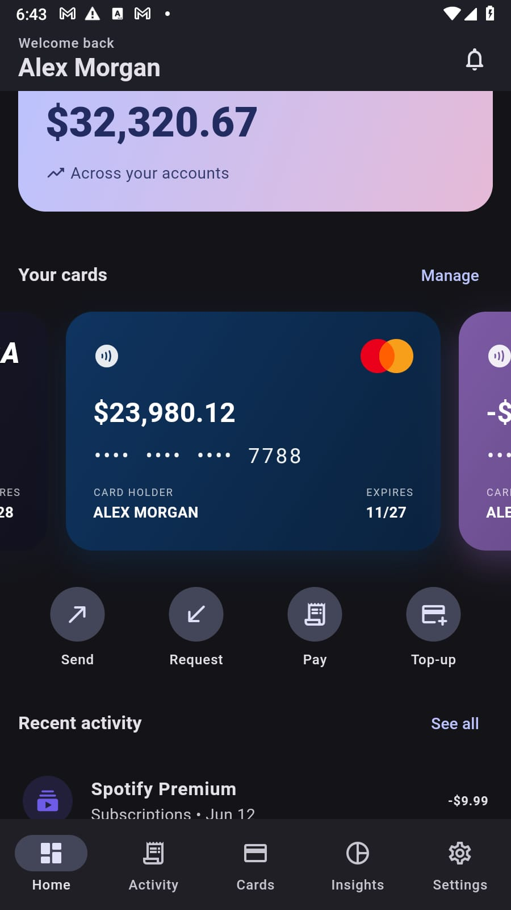
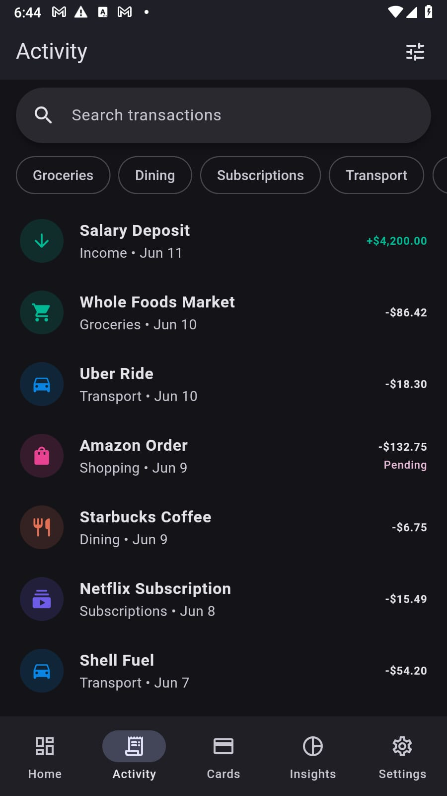
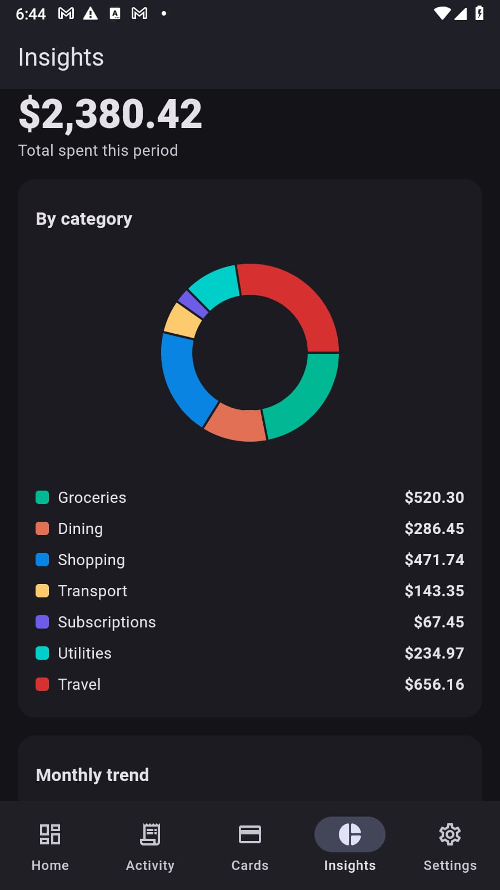

# Aurum Bank — Flutter Fintech (Material 3 + Mock API)

A production-quality, **cross-platform** fintech app built from a single Flutter codebase that
runs on **iOS, Android, Web, macOS, Windows and Linux**. It is strictly **Material 3 (Material
You)** with full light/dark themes and platform **dynamic color**, adapts from phone → tablet →
desktop, and consumes a **mock REST API** through a proper Dio networking + repository layer.
There is **no hardcoded business data in the UI** — every screen loads from the API and has real
loading (shimmer), empty and error states.

## Screenshots

| Dashboard | Transactions | Insights |
| :---: | :---: | :---: |
|  |  |  |

## What the app does

Aurum Bank is a full digital-banking client. A user signs in, sees their balances and cards at a
glance, moves money four different ways, tracks where it went, and manages their profile and
security — all backed by a REST API with realistic loading, empty and error states.

### 🔐 Onboarding & sign-in
- First-launch **onboarding** carousel, then **login**, **register** and **forgot password** flows.
- Session is restored on relaunch from a securely stored token; a branded **splash** holds the app
  until auth is resolved, then routes you to the right place.
- Optional **biometric unlock** (Face ID / fingerprint) where the device supports it.

### 🏠 Dashboard
- **Total balance** across your accounts, with a live currency-formatted headline.
- Swipeable **card carousel** showing each card with its real network branding.
- Four **quick actions** — Send, Request, Pay, Top-up — and a **recent activity** preview.
- Notification **bell with an unread badge**.

### 💸 Move money (4 flows)
- **Send** — pick a beneficiary → enter an amount (balance-validated) → review fees & total →
  confirm → animated success.
- **Request** — generate a shareable **payment request** with a reference code and link you can
  copy and send to anyone.
- **Pay bills** — choose from saved **billers**, enter an amount, and pay from an account
  (balance is debited for real).
- **Top-up** — add funds to an account from a linked card, with quick preset amounts.

### 💳 Accounts & cards
- Browse all cards; open a card for full **details**.
- **Freeze / unfreeze** a card — a frozen card shows a clear black “locked” cover and blocks
  payments.
- **Add a card** (holder, number, expiry, network, color).
- Official **Visa**, **Mastercard** (interlocking circles) and **Amex** brand marks rendered in-app.

### 📋 Transactions
- Searchable, **category-filterable** activity list with pagination.
- Credit/debit styling, **pending / completed / failed** statuses, and a per-transaction **detail**
  view. On wide screens the list and detail show **side-by-side**.

### 📊 Insights
- Spending **donut by category**, **monthly trend**, and **budget** progress — powered by `fl_chart`.

### 🔔 Notifications
- Transaction, security, promo and system notifications with **read / unread** state that drives the
  dashboard badge.

### 👤 Profile & settings
- **Edit profile** — update display name, phone and avatar color (email is read-only).
- **Change password** with current/new/confirm validation.
- **Appearance**: persistent **light / dark / system** theme + Material You **dynamic color**.
- **Language** picker, privacy & security toggles, and **sign out**.

### ✨ Throughout
- **Material 3** design, full **light & dark** themes, and **adaptive** layouts from phone → tablet →
  desktop.
- **No hardcoded business data** — every screen loads from the API with real **shimmer loading**,
  **empty** and **error + retry** states (a chaos interceptor injects latency/failures so these are
  genuinely exercised).

## Tech stack

| Concern | Choice |
| --- | --- |
| State management | Riverpod 3 (`flutter_riverpod`, manual `Notifier`/`AsyncNotifier`) |
| Routing | `go_router` (deep links, web URLs, adaptive `StatefulShellRoute`) |
| Networking | `dio` (auth, logging & latency/chaos interceptors) |
| Models | `freezed` + `json_serializable` (immutable, codegen) |
| Charts | `fl_chart` |
| Storage | `flutter_secure_storage` (token) + `shared_preferences` (theme/locale) |
| Adaptivity | `LayoutBuilder` breakpoints + `dynamic_color` |
| Misc | `intl`, `cached_network_image`, `local_auth` (optional biometric unlock) |

## Architecture

Feature-first clean architecture. See [`docs/ARCHITECTURE.md`](docs/ARCHITECTURE.md) for the full
contract (models, providers, shared widgets).

```
lib/
  core/        env, theme + design tokens, router, dio client + interceptors,
               storage, typed failures, formatters, providers
  data/        models (freezed), repositories (Dio-backed)
  features/    auth, onboarding, dashboard, accounts, transactions, transfer,
               cards, insights, notifications, settings, shell
               (each: application/ controllers + presentation/ screens)
  shared/      reusable widgets (async/loading/error/empty, cards, tiles, skeletons)
  app.dart     MaterialApp.router + dynamic color + theming
  main.dart    bootstraps SharedPreferences + ProviderScope
mock-api/      json-server: db.json, routes.json, server.js
```

Repositories expose domain (freezed) models; Riverpod controllers hold UI state and call
repositories. API/JSON shapes never leak into the UI.

## Primary user journey

> Splash → Onboarding → Auth → **Dashboard** → (Send · Request · Pay · Top-up) · Cards · Transactions
> · Insights · Notifications · Settings → Edit profile / Change password.

See [**What the app does**](#what-the-app-does) above for the full feature breakdown.

## Adaptive layout

| Width | Navigation | Layout |
| --- | --- | --- |
| `< 600dp` (phone) | bottom `NavigationBar` | single column |
| `600–840dp` (tablet) | `NavigationRail` | single column, larger padding |
| `> 840dp` (desktop/web) | extended `NavigationRail` | multi-pane (e.g. transactions list + detail) |

---

## 1. Prerequisites

- Flutter **3.44+** (stable), Dart 3.12+
- Node.js 18+ (for the mock API)

## 2. Run the mock API

```bash
cd mock-api
npm install
npm start               # full server: custom auth/transfer/payment routes + json-server
# or: npm run start:json-only   # plain json-server CRUD only (no custom routes)
```

The API listens on `http://localhost:3000` (override with `PORT`). Endpoints:

```
POST  /auth/login            -> { token, user }
POST  /auth/register         -> { token, user }
GET   /auth/me               -> user
POST  /auth/change-password  -> { ok }            (validates length)
GET   /accounts              PATCH /accounts/:id   (balance; used by top-up / pay-bills)
GET   /cards     GET /cards/:id     PATCH /cards/:id   (toggle "frozen")
GET   /transactions?accountId=&category=&from=&to=&q=&_page=&_limit=
GET   /transactions/:id
GET   /beneficiaries
POST  /transfers
GET   /billers               POST /payments          (pay bills)
POST  /paymentRequests       (request money)
GET   /insights/spending
GET   /notifications     PATCH /notifications/:id   (toggle "read")
```

Seed data: 1 user, 3 accounts, 3 cards, 40 transactions, 5 beneficiaries, 6 notifications,
6 billers, and a spending-insights object.

## 3. Run the app

```bash
flutter pub get
dart run build_runner build      # generates *.freezed.dart / *.g.dart (first run / after model edits)
flutter run                      # pick a device, or use the flags below
```

### Per platform (no code changes required)

```bash
flutter run -d chrome            # Web
flutter run -d windows           # Windows
flutter run -d macos             # macOS
flutter run -d linux             # Linux
flutter run -d <android-device>  # Android
flutter run -d <ios-device>      # iOS (run `pod install` in ios/ on first build)
```

## 4. Switching the API base URL

`baseUrl` defaults to `http://localhost:3000` and is configurable at run time with no code
changes via `--dart-define`:

```bash
flutter run --dart-define=API_BASE_URL=http://10.0.2.2:3000     # Android emulator -> host
flutter run --dart-define=API_BASE_URL=http://192.168.1.20:3000 # physical device on LAN
```

The Dio chaos interceptor (300–800 ms latency + occasional GET failures, so loading/error states
are real) can be turned off:

```bash
flutter run --dart-define=SIMULATE_NETWORK=false
```

> **Android note:** the emulator reaches your machine at `10.0.2.2`, not `localhost`. For physical
> devices use your machine's LAN IP and ensure both are on the same network.

## 5. Quality checks

```bash
flutter analyze     # clean — no issues
flutter test        # unit + widget + repository (mocked Dio) tests
dart format .
```

## Platform notes

- **Windows desktop:** building with plugins requires symlink support — enable *Developer Mode*
  (`start ms-settings:developers`) once.
- **local_auth:** biometric unlock is optional and self-guarding — on platforms/devices without
  biometrics the button simply reports it is unavailable, so the app still builds and runs
  everywhere with no code changes.

## Demo credentials

Any email containing `@` and a password of 4+ characters works (the mock API accepts all logins).
The login screen is pre-filled with `alex@demo.app`.
